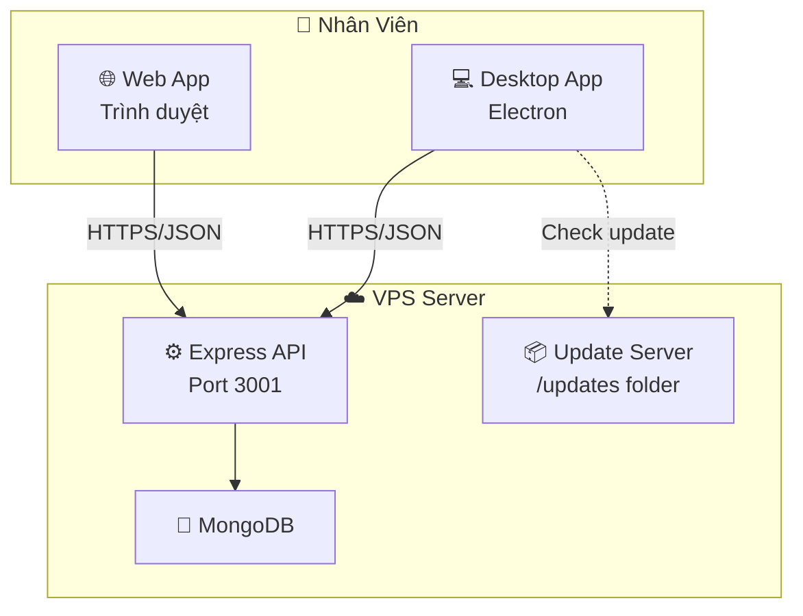
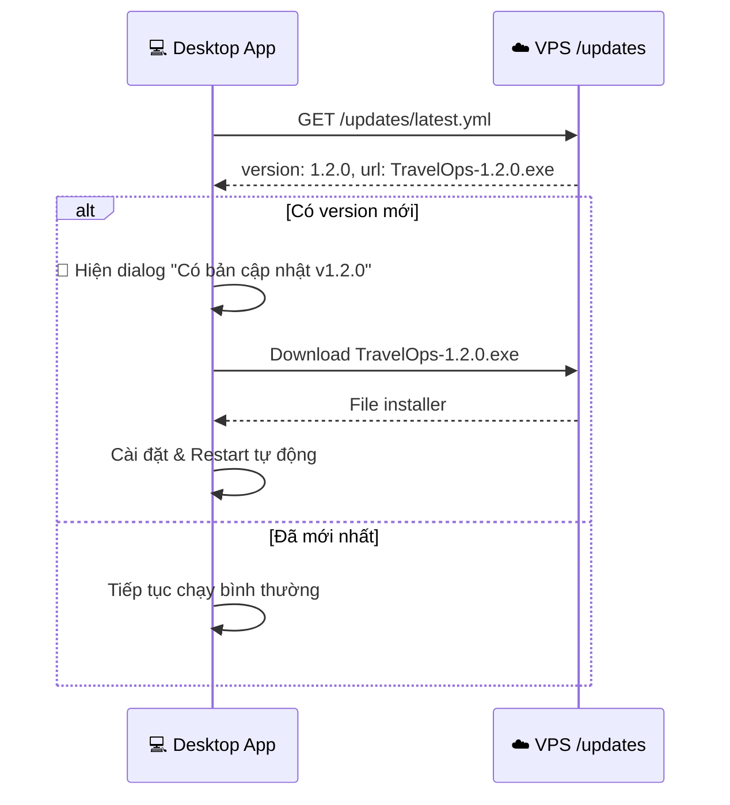

# TravelOps — Ứng Dụng Quản Lý Công Ty Du Lịch (Full-Stack + Desktop)

Xây dựng ứng dụng **full-stack** quản lý công việc, tour du lịch, và giấy tờ xét duyệt cho công ty du lịch chuyên bán tour, quy mô 30–40 nhân sự. Hỗ trợ cả **Web App** lẫn **Desktop App** với tính năng auto-update.

---

## Kiến Trúc Tổng Quan



### Tech Stack

| Layer | Công nghệ | Vai trò |
|-------|-----------|---------|
| **Frontend** | Vite + React 18 | UI chung cho Web & Desktop |
| **Styling** | Vanilla CSS (dark glassmorphism) | Giao diện premium |
| **Icons** | Lucide React | Icon system |
| **Charts** | Recharts | Biểu đồ dashboard |
| **Backend** | Node.js + Express | REST API |
| **Database** | MongoDB + Mongoose | Lưu trữ dữ liệu |
| **Auth** | JWT + bcryptjs | Xác thực & phân quyền |
| **Desktop** | Electron 32+ | Đóng gói desktop app |
| **Auto-Update** | electron-updater | Tự cập nhật từ VPS |
| **Build** | electron-builder | Đóng gói .exe / .dmg |

---

## User Review Required

> [!IMPORTANT]
> **MongoDB**: Cần cài MongoDB trên VPS (hoặc dùng MongoDB Atlas free tier để dev trước). Trên máy dev local cũng cần cài MongoDB Community Server để test.

> [!NOTE]
> **Desktop auto-update flow**: Khi build version mới, upload file installer lên VPS vào thư mục `/updates`. Desktop app sẽ tự kiểm tra và thông báo cập nhật cho nhân viên.

---

## Cấu Trúc Thư Mục

```
d:\App\AppQuanLy\
│
├── server/                         # ⚙️ Backend API
│   ├── src/
│   │   ├── config/
│   │   │   └── database.js         # MongoDB connection
│   │   ├── models/                 # Mongoose schemas
│   │   │   ├── User.js
│   │   │   ├── Tour.js
│   │   │   ├── Task.js
│   │   │   ├── Approval.js
│   │   │   ├── Booking.js
│   │   │   └── Notification.js
│   │   ├── middleware/
│   │   │   ├── auth.js             # JWT verify
│   │   │   └── rbac.js             # Role-based access
│   │   ├── routes/
│   │   │   ├── auth.js
│   │   │   ├── users.js
│   │   │   ├── tours.js
│   │   │   ├── tasks.js
│   │   │   ├── approvals.js
│   │   │   ├── bookings.js
│   │   │   ├── dashboard.js
│   │   │   └── notifications.js
│   │   ├── seed.js                 # Dữ liệu mẫu
│   │   └── index.js                # Entry point
│   └── package.json
│
├── client/                         # 🖥️ Frontend (React)
│   ├── src/
│   │   ├── components/
│   │   │   ├── Layout/
│   │   │   │   ├── Sidebar.jsx
│   │   │   │   ├── Header.jsx
│   │   │   │   └── MainLayout.jsx
│   │   │   ├── UI/
│   │   │   │   ├── Button.jsx
│   │   │   │   ├── Modal.jsx
│   │   │   │   ├── DataTable.jsx
│   │   │   │   ├── Card.jsx
│   │   │   │   ├── Badge.jsx
│   │   │   │   ├── StatCard.jsx
│   │   │   │   ├── Tabs.jsx
│   │   │   │   └── Toast.jsx
│   │   │   └── Charts/
│   │   │       └── DashboardCharts.jsx
│   │   ├── pages/
│   │   │   ├── Login/
│   │   │   │   └── Login.jsx
│   │   │   ├── Dashboard/
│   │   │   │   └── Dashboard.jsx
│   │   │   ├── Tasks/
│   │   │   │   ├── TaskBoard.jsx
│   │   │   │   ├── TaskDetail.jsx
│   │   │   │   └── TaskForm.jsx
│   │   │   ├── Tours/
│   │   │   │   ├── TourList.jsx
│   │   │   │   ├── TourDetail.jsx
│   │   │   │   ├── TourForm.jsx
│   │   │   │   └── BookingList.jsx
│   │   │   ├── Approvals/
│   │   │   │   ├── ApprovalList.jsx
│   │   │   │   ├── ApprovalDetail.jsx
│   │   │   │   └── ApprovalForm.jsx
│   │   │   └── Staff/
│   │   │       ├── StaffList.jsx
│   │   │       ├── StaffDetail.jsx
│   │   │       └── OrgChart.jsx
│   │   ├── contexts/
│   │   │   └── AuthContext.jsx
│   │   ├── services/
│   │   │   └── api.js              # API client (fetch wrapper)
│   │   ├── utils/
│   │   │   └── helpers.js
│   │   ├── styles/
│   │   │   ├── index.css           # Design system
│   │   │   └── components.css      # Component styles
│   │   ├── App.jsx
│   │   └── main.jsx
│   ├── index.html
│   └── package.json
│
├── desktop/                        # 💻 Electron App
│   ├── main.js                     # Electron main process
│   ├── preload.js                  # Preload script (security)
│   ├── updater.js                  # Auto-update logic
│   ├── package.json                # Electron deps + electron-builder config
│   └── assets/
│       └── icon.png                # App icon
│
├── package.json                    # Root: scripts chạy đồng thời
└── README.md
```

---

## Database Schema (MongoDB)

### Collection: `users`
```javascript
{
  _id: ObjectId,
  username: String,          // unique, dùng để đăng nhập
  passwordHash: String,
  fullName: String,          // "Nguyễn Văn A"
  email: String,
  phone: String,
  avatar: String,            // URL hoặc base64
  department: String,        // "director" | "hr" | "sale" | "marketing" | "it"
  role: String,              // "director" | "hr_manager" | "hr_staff" | "sale_manager" | ...
  position: String,          // "Giám Đốc" | "Trưởng Phòng Sale" | ...
  status: String,            // "active" | "inactive"
  createdAt: Date
}
```

### Collection: `tours`
```javascript
{
  _id: ObjectId,
  code: String,              // "TOUR-DN-001" (unique)
  name: String,              // "Tour Đà Nẵng - Hội An 4N3Đ"
  destination: String,
  description: String,
  durationDays: Number,
  durationNights: Number,
  price: {
    adult: Number,           // 5990000
    child: Number,           // 3990000
    surcharge: Number        // Phụ thu phòng đơn
  },
  status: String,            // "draft" | "active" | "departing" | "completed" | "cancelled"
  departureDate: Date,
  returnDate: Date,
  maxGuests: Number,
  itinerary: [{              // Lịch trình từng ngày
    day: Number,
    title: String,
    description: String,
    meals: [String]          // ["Sáng", "Trưa", "Tối"]
  }],
  includes: [String],        // Bao gồm
  excludes: [String],        // Không bao gồm
  images: [String],
  saleInCharge: ObjectId,    // ref: users
  createdBy: ObjectId,       // ref: users
  createdAt: Date,
  updatedAt: Date
}
```

### Collection: `tasks`
```javascript
{
  _id: ObjectId,
  code: String,              // "TASK-001"
  title: String,
  description: String,
  status: String,            // "todo" | "in_progress" | "review" | "done"
  priority: String,          // "low" | "medium" | "high" | "urgent"
  assignee: ObjectId,        // ref: users
  department: String,
  deadline: Date,
  tags: [String],
  comments: [{
    user: ObjectId,
    content: String,
    createdAt: Date
  }],
  subtasks: [{
    title: String,
    completed: Boolean
  }],
  createdBy: ObjectId,
  createdAt: Date,
  updatedAt: Date
}
```

### Collection: `approvals`
```javascript
{
  _id: ObjectId,
  code: String,              // "APR-001"
  type: String,              // "expense" | "leave" | "travel" | "purchase" | "partnership" | "other"
  title: String,
  content: String,           // Nội dung chi tiết
  amount: Number,            // Số tiền (nếu có)
  department: String,
  status: String,            // "draft" | "pending_manager" | "pending_director" | "approved" | "rejected" | "returned"
  approvalFlow: [{
    stepOrder: Number,
    roleRequired: String,    // "manager" | "director"
    reviewer: ObjectId,      // ref: users
    status: String,          // "pending" | "approved" | "rejected" | "returned"
    note: String,
    reviewedAt: Date
  }],
  attachments: [{
    name: String,
    url: String
  }],
  createdBy: ObjectId,
  createdAt: Date,
  updatedAt: Date
}
```

### Collection: `bookings`
```javascript
{
  _id: ObjectId,
  code: String,              // "BK-001"
  tour: ObjectId,            // ref: tours
  customerName: String,
  customerPhone: String,
  customerEmail: String,
  adults: Number,
  children: Number,
  totalPrice: Number,
  status: String,            // "pending" | "confirmed" | "paid" | "completed" | "cancelled"
  note: String,
  createdBy: ObjectId,       // Sale người tạo
  createdAt: Date,
  updatedAt: Date
}
```

### Collection: `notifications`
```javascript
{
  _id: ObjectId,
  user: ObjectId,            // ref: users
  type: String,              // "task" | "approval" | "tour" | "system"
  title: String,
  message: String,
  link: String,              // URL trong app để navigate
  isRead: Boolean,
  createdAt: Date
}
```

---

## API Endpoints

### 🔐 Authentication
| Method | Endpoint | Mô tả |
|--------|----------|-------|
| `POST` | `/api/auth/login` | Đăng nhập → JWT token |
| `GET` | `/api/auth/me` | Thông tin user hiện tại |
| `PUT` | `/api/auth/password` | Đổi mật khẩu |

### 👥 Users
| Method | Endpoint | Quyền | Mô tả |
|--------|----------|-------|-------|
| `GET` | `/api/users` | All | Danh sách (search, filter, paginate) |
| `GET` | `/api/users/:id` | All | Chi tiết nhân viên |
| `POST` | `/api/users` | Director, HR | Tạo mới |
| `PUT` | `/api/users/:id` | Director, HR | Cập nhật |
| `DELETE` | `/api/users/:id` | Director | Xóa |

### 🏖️ Tours
| Method | Endpoint | Quyền | Mô tả |
|--------|----------|-------|-------|
| `GET` | `/api/tours` | All | Danh sách (filter destination, status, date) |
| `GET` | `/api/tours/:id` | All | Chi tiết + bookings count |
| `POST` | `/api/tours` | Director, Sale | Tạo tour mới |
| `PUT` | `/api/tours/:id` | Director, Sale (owner) | Cập nhật |
| `DELETE` | `/api/tours/:id` | Director | Xóa |

### 📋 Tasks
| Method | Endpoint | Quyền | Mô tả |
|--------|----------|-------|-------|
| `GET` | `/api/tasks` | All | Danh sách (filter status, dept, assignee) |
| `GET` | `/api/tasks/:id` | All | Chi tiết + comments |
| `POST` | `/api/tasks` | All (managers giao việc) | Tạo task |
| `PUT` | `/api/tasks/:id` | Owner, Assignee | Cập nhật |
| `PATCH` | `/api/tasks/:id/status` | Assignee | Đổi trạng thái (Kanban) |
| `POST` | `/api/tasks/:id/comments` | All | Thêm comment |

### 📄 Approvals
| Method | Endpoint | Quyền | Mô tả |
|--------|----------|-------|-------|
| `GET` | `/api/approvals` | All | Danh sách (tabs: pending/approved/rejected) |
| `GET` | `/api/approvals/:id` | All | Chi tiết + approval flow |
| `POST` | `/api/approvals` | All | Tạo đề xuất |
| `PATCH` | `/api/approvals/:id/review` | Manager, Director | Duyệt / Từ chối / Trả lại |
| `DELETE` | `/api/approvals/:id` | Owner (chỉ khi draft) | Hủy |

### 🎫 Bookings
| Method | Endpoint | Quyền | Mô tả |
|--------|----------|-------|-------|
| `GET` | `/api/bookings` | Sale, Director | Danh sách |
| `POST` | `/api/bookings` | Sale | Tạo booking |
| `PUT` | `/api/bookings/:id` | Sale (owner) | Cập nhật |
| `PATCH` | `/api/bookings/:id/status` | Sale, Director | Đổi trạng thái |

### 📊 Dashboard
| Method | Endpoint | Quyền | Mô tả |
|--------|----------|-------|-------|
| `GET` | `/api/dashboard/stats` | All (filtered by role) | Thống kê tổng quan |
| `GET` | `/api/dashboard/revenue` | Director, Sale | Doanh thu theo thời gian |

### 🔔 Notifications
| Method | Endpoint | Mô tả |
|--------|----------|-------|
| `GET` | `/api/notifications` | Danh sách thông báo |
| `PATCH` | `/api/notifications/:id/read` | Đánh dấu đã đọc |
| `PATCH` | `/api/notifications/read-all` | Đọc tất cả |

---

## Phân Quyền RBAC

| Hành Động | Director | Manager (phòng) | Staff |
|-----------|----------|-----------------|-------|
| Dashboard tổng | ✅ | Phòng mình | Cá nhân |
| CRUD nhân sự | ✅ Full | ❌ | ❌ |
| Tạo/sửa tour | ✅ | ✅ Sale Manager | ✅ Sale Staff |
| Xóa tour | ✅ | ❌ | ❌ |
| Duyệt cuối (đề xuất) | ✅ | ❌ | ❌ |
| Duyệt bước 1 (đề xuất) | ✅ | ✅ | ❌ |
| Giao việc liên phòng | ✅ | ❌ | ❌ |
| Giao việc trong phòng | ✅ | ✅ | ❌ |
| Tạo booking | ✅ | ✅ Sale | ✅ Sale |
| Báo cáo doanh thu | ✅ | ✅ Sale Manager | ❌ |

---

## Desktop App — Auto-Update Flow



### Cách hoạt động:

1. **Build**: Khi có update, build Electron app → tạo file `.exe` + `latest.yml`
2. **Upload**: Upload lên VPS vào thư mục `/var/www/updates/`
3. **Check**: Desktop app tự check mỗi khi khởi động (hoặc mỗi 1 giờ)
4. **Update**: Hiện dialog cho user → Download → Install → Restart

### `desktop/main.js` — Electron Main Process
```javascript
// Tóm tắt logic:
// 1. Tạo BrowserWindow load React app (build hoặc dev URL)
// 2. Check update khi app ready
// 3. Auto-update events: checking → available → downloaded → restart
```

### `desktop/updater.js` — Auto-Update Config
```javascript
// electron-updater config:
// - provider: "generic"
// - url: "https://your-vps.com/updates"  
// - autoDownload: false (hỏi user trước)
// - autoInstallOnAppQuit: true
```

### `desktop/package.json` — electron-builder config
```json
{
  "build": {
    "appId": "com.travelops.app",
    "productName": "TravelOps",
    "publish": {
      "provider": "generic",
      "url": "https://your-vps.com/updates"
    },
    "win": {
      "target": "nsis",
      "icon": "assets/icon.png"
    },
    "nsis": {
      "oneClick": true,
      "allowToChangeInstallationDirectory": false,
      "installerLanguages": ["vi_VN"]
    }
  }
}
```

---

## Proposed Changes — Theo Phase

### Phase 1: Backend Foundation (~14 files)
| # | File | Mô tả |
|---|------|-------|
| 1 | `server/package.json` | Dependencies: express, mongoose, jsonwebtoken, bcryptjs, cors, morgan |
| 2 | `server/src/index.js` | Express setup, MongoDB connect, mount routes |
| 3 | `server/src/config/database.js` | Mongoose connection config |
| 4 | `server/src/models/User.js` | User schema + methods |
| 5 | `server/src/models/Tour.js` | Tour schema |
| 6 | `server/src/models/Task.js` | Task schema |
| 7 | `server/src/models/Approval.js` | Approval schema |
| 8 | `server/src/models/Booking.js` | Booking schema |
| 9 | `server/src/models/Notification.js` | Notification schema |
| 10 | `server/src/middleware/auth.js` | JWT verify middleware |
| 11 | `server/src/middleware/rbac.js` | Role check middleware |
| 12 | `server/src/routes/auth.js` | Login, me, password |
| 13 | `server/src/routes/users.js` | CRUD users |
| 14 | `server/src/routes/tours.js` | CRUD tours |
| 15 | `server/src/routes/tasks.js` | CRUD tasks + comments |
| 16 | `server/src/routes/approvals.js` | CRUD + review flow |
| 17 | `server/src/routes/bookings.js` | CRUD bookings |
| 18 | `server/src/routes/dashboard.js` | Stats aggregation |
| 19 | `server/src/routes/notifications.js` | Notifications |
| 20 | `server/src/seed.js` | Dữ liệu mẫu: 35 NV, 15 tour, 25 task, 20 approval |

### Phase 2: Frontend Foundation (~8 files)
| # | File | Mô tả |
|---|------|-------|
| 1 | `client/package.json` | React, react-router-dom, lucide-react, recharts |
| 2 | `client/src/styles/index.css` | Design system, dark theme, glassmorphism |
| 3 | `client/src/styles/components.css` | Component styles |
| 4 | `client/src/services/api.js` | Fetch wrapper + JWT headers |
| 5 | `client/src/contexts/AuthContext.jsx` | Auth state management |
| 6 | `client/src/components/Layout/Sidebar.jsx` | Navigation |
| 7 | `client/src/components/Layout/Header.jsx` | Search, notifications |
| 8 | `client/src/components/Layout/MainLayout.jsx` | Layout wrapper |

### Phase 3: UI Components (~8 files)
| # | File | Mô tả |
|---|------|-------|
| 1-8 | `client/src/components/UI/*.jsx` | Button, Modal, DataTable, Card, Badge, StatCard, Tabs, Toast |

### Phase 4: Pages — Login + Dashboard (~2 files)
| # | File | Mô tả |
|---|------|-------|
| 1 | `client/src/pages/Login/Login.jsx` | Login page |
| 2 | `client/src/pages/Dashboard/Dashboard.jsx` | Dashboard + charts |

### Phase 5: Pages — Tasks (~3 files)
| # | File | Mô tả |
|---|------|-------|
| 1 | `client/src/pages/Tasks/TaskBoard.jsx` | Kanban board |
| 2 | `client/src/pages/Tasks/TaskDetail.jsx` | Task detail + comments |
| 3 | `client/src/pages/Tasks/TaskForm.jsx` | Create/edit task |

### Phase 6: Pages — Tours (~4 files)
| # | File | Mô tả |
|---|------|-------|
| 1 | `client/src/pages/Tours/TourList.jsx` | Tour list grid/table |
| 2 | `client/src/pages/Tours/TourDetail.jsx` | Tour detail + itinerary |
| 3 | `client/src/pages/Tours/TourForm.jsx` | Create/edit tour |
| 4 | `client/src/pages/Tours/BookingList.jsx` | Booking management |

### Phase 7: Pages — Approvals (~3 files)
| # | File | Mô tả |
|---|------|-------|
| 1 | `client/src/pages/Approvals/ApprovalList.jsx` | Approval list + tabs |
| 2 | `client/src/pages/Approvals/ApprovalDetail.jsx` | Detail + review timeline |
| 3 | `client/src/pages/Approvals/ApprovalForm.jsx` | Create approval |

### Phase 8: Pages — Staff (~3 files)
| # | File | Mô tả |
|---|------|-------|
| 1 | `client/src/pages/Staff/StaffList.jsx` | Staff table/cards |
| 2 | `client/src/pages/Staff/StaffDetail.jsx` | Staff profile |
| 3 | `client/src/pages/Staff/OrgChart.jsx` | Org chart |

### Phase 9: App Assembly (~3 files)
| # | File | Mô tả |
|---|------|-------|
| 1 | `client/src/App.jsx` | Router, protected routes |
| 2 | `client/index.html` | HTML entry |
| 3 | `package.json` (root) | Concurrently scripts |

### Phase 10: Desktop App + Auto-Update (~4 files)
| # | File | Mô tả |
|---|------|-------|
| 1 | `desktop/package.json` | Electron + electron-builder config |
| 2 | `desktop/main.js` | Electron main process |
| 3 | `desktop/preload.js` | Preload script (IPC bridge) |
| 4 | `desktop/updater.js` | Auto-update logic |

---

## Design — Giao Diện

### Color Palette (Dark Travel Theme)
| Token | Màu | Mục đích |
|-------|-----|----------|
| `--primary` | `#0EA5E9` Sky Blue | Actions, links |
| `--secondary` | `#F97316` Orange | CTA, highlights |
| `--success` | `#22C55E` | Đã duyệt, hoàn thành |
| `--warning` | `#EAB308` | Chờ xử lý |
| `--danger` | `#EF4444` | Từ chối, xóa |
| `--bg` | `#0F172A` | Nền chính |
| `--surface` | `#1E293B` | Cards, sidebar |
| `--surface-hover` | `#334155` | Hover |
| `--text` | `#F8FAFC` | Text chính |
| `--text-muted` | `#94A3B8` | Text phụ |
| `--border` | `#334155` | Viền |
| `--glass` | `rgba(255,255,255,0.05)` | Glassmorphism |

### Font: Inter (Google Fonts) — hỗ trợ Tiếng Việt

---

## Verification Plan

### Backend
```bash
cd server && npm install
npm run seed        # Tạo dữ liệu mẫu
npm run dev         # Chạy API server port 3001
# Test API với curl/Postman
```

### Frontend
```bash
cd client && npm install
npm run dev         # Chạy Vite dev server port 5173
npm run build       # Build check
```

### Desktop
```bash
cd desktop && npm install
npm run dev         # Chạy Electron dev mode
npm run build       # Build .exe installer
```

### Chạy đồng thời (root)
```bash
npm run dev         # Chạy server + client cùng lúc
```

### Manual Testing
- Login từng role (9 roles) → kiểm tra menu & quyền
- CRUD đầy đủ các module
- Quy trình xét duyệt end-to-end
- Kanban drag & drop
- Dashboard charts
- Desktop app launch + auto-update check
- Responsive layout

---

## Tóm Tắt

| Phase | Nội Dung | Files |
|-------|----------|-------|
| 1 | Backend (Express + MongoDB + Routes) | ~20 |
| 2 | Frontend Foundation | ~8 |
| 3 | UI Components | ~8 |
| 4 | Login + Dashboard | ~2 |
| 5 | Module Tasks (Kanban) | ~3 |
| 6 | Module Tours | ~4 |
| 7 | Module Approvals | ~3 |
| 8 | Module Staff | ~3 |
| 9 | App Assembly | ~3 |
| 10 | Desktop + Auto-Update | ~4 |
| **Tổng** | | **~58 files** |
